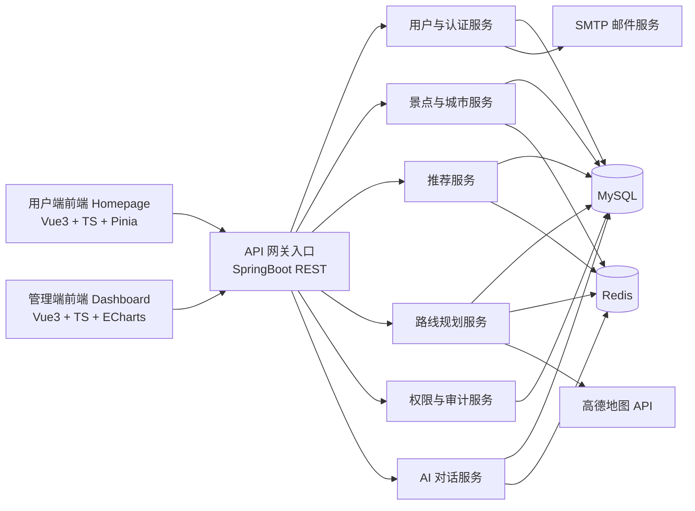
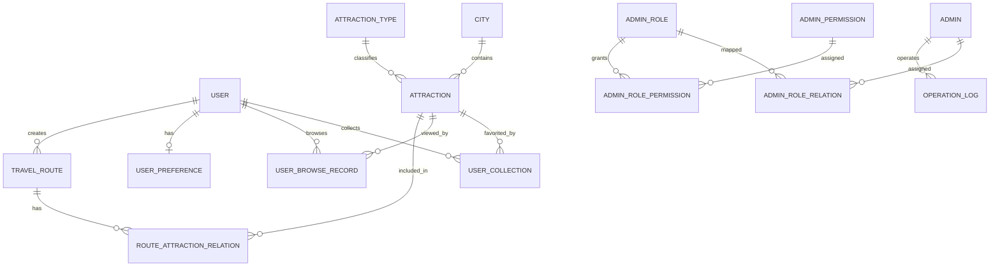
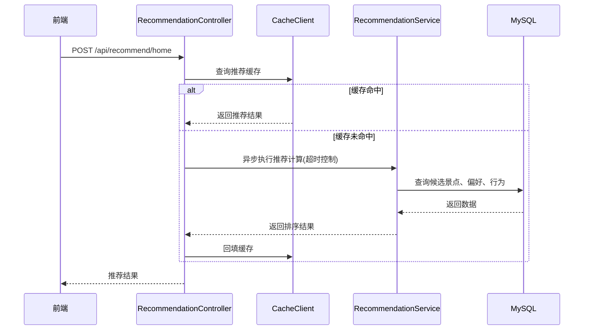
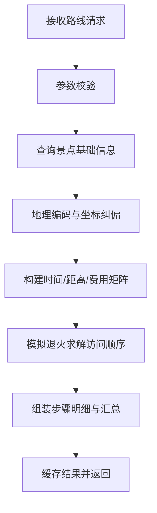
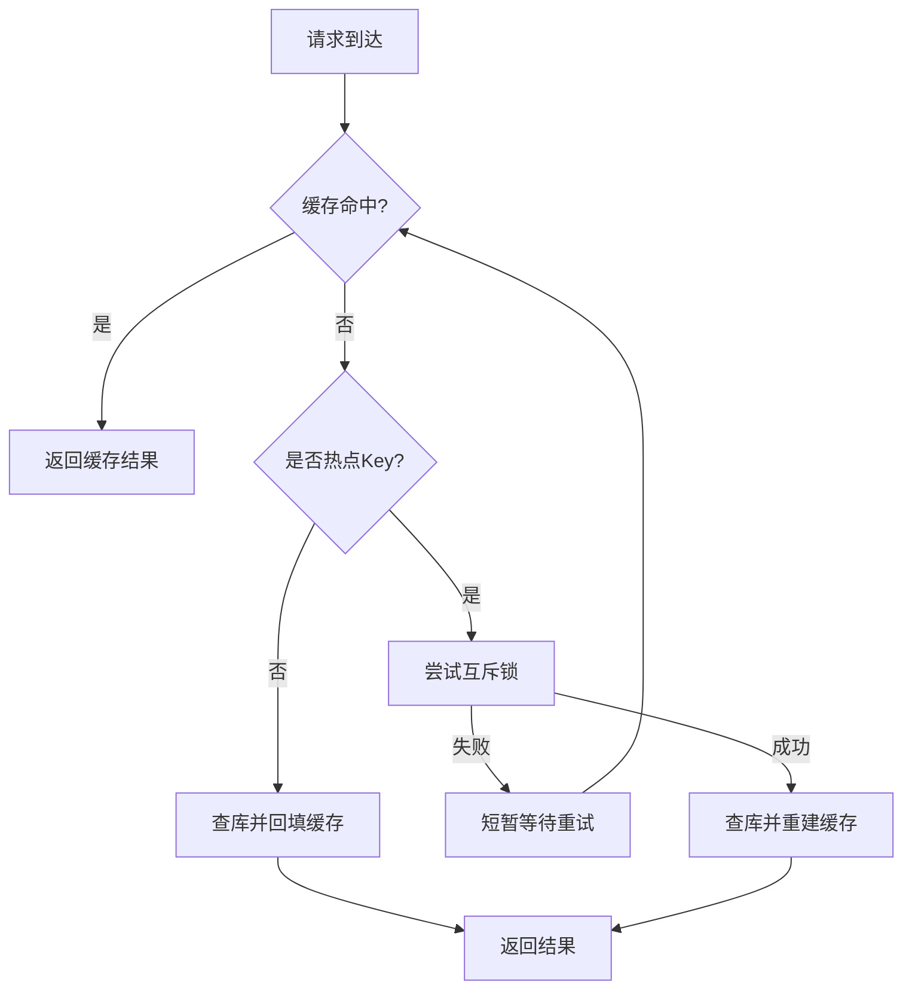

# 基于 Vue3 与 SpringBoot 的旅游推荐系统设计与实现

## 1 绪论

### 1.1 研究背景与意义

随着移动互联网与在线旅游平台的快速发展，用户在面对海量旅游信息时常出现“选择困难”。传统旅游信息系统通常以静态展示为主，缺少基于用户偏好和行为的动态推荐能力，难以满足个性化旅游规划需求。与此同时，旅游路线规划涉及交通时间、花费预算、景点顺序等多约束因素，人工规划效率低、质量不稳定。

针对上述问题，本文结合前后端分离架构与智能算法，设计并实现一套旅游推荐系统。系统以 Vue3 + TypeScript 构建双前端应用（用户端与管理端），以 SpringBoot + MyBatis-Plus + MySQL + Redis 构建后端服务，融合内容推荐与模拟退火路线优化，实现“信息展示-个性化推荐-路径规划-运营管理”完整闭环。

本课题研究意义体现在以下方面：

1. 工程价值：构建可直接部署的完整系统，具备实际应用可行性。
2. 算法价值：将推荐评分与模拟退火算法应用到旅游场景，提升决策质量。
3. 架构价值：通过缓存、线程池、权限模型等机制提升系统性能与可维护性。
4. 教学价值：形成从需求分析、系统设计到测试评估的全流程实践样例。

### 1.2 国内外研究现状

国内外在旅游推荐与路线优化领域的研究主要集中在以下方向：

1. 推荐系统方向：
   国内平台广泛采用协同过滤和内容推荐融合方案，重点关注点击率与转化率提升；国外研究更强调多模态数据融合（文本、图像、地理位置、时间上下文）与在线学习机制。
2. 路线规划方向：
   经典方法包括最短路径、旅行商问题（TSP）及其启发式算法。由于旅游规划目标并非单一最短路，而是时间、费用、体验的多目标平衡，模拟退火、遗传算法等元启发式方法得到广泛应用。
3. 系统工程方向：
   行业实践普遍采用前后端分离、缓存加速、权限控制与日志审计，但在高校课程项目中，常见问题是“功能有而体系弱”，表现为性能与安全设计不完整。

综合现有研究可见，单点算法研究较多，而“可落地系统 + 全链路工程治理”的综合实践相对不足。本文在真实项目中将推荐、路径优化、权限管控与性能优化统一设计，弥补这一缺口。

### 1.3 研究内容与研究方法

本文主要研究内容如下：

1. 完成旅游推荐系统的需求建模与总体架构设计。
2. 实现用户端与管理端双前端协同系统。
3. 构建基于 SpringBoot 的 REST 后端服务与 MySQL 数据模型。
4. 实现个性化推荐机制与模拟退火路线规划算法。
5. 设计并落地 Redis 缓存、线程池、索引优化、RBAC 权限控制。
6. 通过功能测试与性能测试验证系统有效性。

研究方法包括：

1. 文献分析法：梳理推荐系统与路线优化理论。
2. 面向对象分析与设计方法：完成模块划分与接口建模。
3. 对比实验法：通过优化前后指标对比评估性能收益。
4. 工程实践法：基于真实代码实现并持续迭代。

### 1.4 论文结构安排

本文共分七章：

1. 第一章介绍研究背景、意义、现状与研究内容。
2. 第二章说明系统采用的关键技术与理论基础。
3. 第三章完成系统需求与可行性分析。
4. 第四章给出总体架构、数据库与业务流程设计。
5. 第五章详细阐述系统实现与核心算法落地。
6. 第六章给出测试过程、结果与性能分析。
7. 第七章总结全文并提出后续改进方向。

## 2 相关技术与理论基础

### 2.1 前端技术基础

#### 2.1.1 Vue3 与组合式 API

本系统前端基于 Vue3 开发，采用组合式 API 组织业务逻辑。与传统 Options API 相比，组合式 API 具有以下优势：

1. 逻辑聚合性更强：同一功能相关状态、计算属性、方法可集中定义。
2. 复用能力更好：可将登录校验、收藏状态等逻辑抽取为可复用组合函数。
3. 类型友好：与 TypeScript 结合后可获得更准确的类型推断。

用户端通过 [frontend-apps/homepage/src/routers/index.ts](frontend-apps/homepage/src/routers/index.ts) 组织首页、探索、热门城市、路线规划、个人中心与景点详情路由；管理端通过 [frontend-apps/dashboard/src/router/index.ts](frontend-apps/dashboard/src/router/index.ts) 组织数据大屏、用户管理、景点管理、权限管理等管理页面。

#### 2.1.2 TypeScript 与工程约束

系统两端前端均使用 TypeScript。其核心价值在于：

1. 通过接口约束 API 入参与返回值，减少“字段拼写错误”和“空值未处理”问题。
2. 在重构时提供静态检查，降低回归风险。
3. 与 IDE 联动提升可维护性，尤其适合多模块管理系统。

例如，用户端请求封装在 [frontend-apps/homepage/src/apis/request.ts](frontend-apps/homepage/src/apis/request.ts)，管理端请求封装在 [frontend-apps/dashboard/src/apis/request.ts](frontend-apps/dashboard/src/apis/request.ts)，均通过类型定义统一响应结构。

#### 2.1.3 Vite 构建机制

前端使用 Vite 作为构建工具，特点如下：

1. 基于原生 ES Module，开发阶段按需编译，启动速度快。
2. 热更新效率高，适合高频迭代。
3. 生产环境使用 Rollup 打包，兼顾构建速度与产物体积。

在本项目中，用户端与管理端均独立构建与部署，降低了单体前端工程复杂度。

#### 2.1.4 Element Plus 与 ECharts

系统 UI 组件主要基于 Element Plus 实现，包括表单、表格、弹窗、分页等高频管理组件。管理端数据看板使用 ECharts 绘制折线、柱状、饼图等可视化图表，支持趋势分析与分布统计。

以 [frontend-apps/dashboard/src/views/Dashboard.vue](frontend-apps/dashboard/src/views/Dashboard.vue) 为例，页面包含：

1. 概览指标卡（用户数、景点数、路线规划次数等）。
2. 30 天趋势折线图。
3. 热门景点 TOP10 柱状图。
4. 出行人群、方式、偏好分布饼图。

### 2.2 后端技术基础

#### 2.2.1 SpringBoot 与 REST API

后端基于 SpringBoot 3.5.12 构建，采用 REST 风格开放接口。控制器层覆盖用户、景点、推荐、路线规划、轮播图、管理员、权限、文件上传、AI 对话等业务域。接口采用统一响应结构 ApiResponse，便于前端处理。

核心特性包括：

1. 注解式接口定义与参数校验。
2. AOP 操作日志记录。
3. 异步执行与定时任务（@EnableAsync、@EnableScheduling）。

#### 2.2.2 MyBatis-Plus 与 MySQL

系统使用 MyBatis-Plus 作为 ORM 框架，提供通用 CRUD、LambdaQueryWrapper 条件构造与分页插件。数据库采用 MySQL 8，主要承载用户、景点、路线与权限数据。

分页拦截器配置于 [backend/springProject/src/main/java/io/github/uchkun07/travelsystem/config/MyBatisPlusConfig.java](backend/springProject/src/main/java/io/github/uchkun07/travelsystem/config/MyBatisPlusConfig.java)，通过设置最大单页限制与溢出策略控制查询成本。

#### 2.2.3 Redis 缓存机制

Redis 在系统中主要用于：

1. Token 黑名单管理（用户与管理员登出后失效控制）。
2. 路径成本缓存（高德 API 结果缓存）。
3. 高并发热点缓存（景点列表、详情、热门、推荐、路线结果）。
4. AI 会话历史缓存（SSE 聊天上下文）。

本项目在缓存层引入了空值缓存、互斥锁重建、TTL 抖动和预热机制，提升了高并发稳定性。

#### 2.2.4 模拟退火算法理论基础

模拟退火（Simulated Annealing）是一种近似全局优化算法，适合求解组合优化问题。其核心思想是：在较高“温度”下允许接受较差解以跳出局部最优，温度逐渐降低后趋于收敛。

本文将路线规划建模为“景点访问顺序优化”问题，目标是平衡时间与费用。

接受概率公式如下：

$$
P(\text{accept}) = \exp\left(-\frac{\Delta E}{T}\right)
$$

其中，$\Delta E$ 为新解与当前解的代价差，$T$ 为当前温度。

#### 2.2.5 RBAC 权限模型

系统采用 RBAC（Role-Based Access Control）模型，将权限与角色解耦，再将角色分配给管理员。模型包含四类核心实体：管理员、角色、权限、关联关系。

后端实现上，权限通过 @RequireAdminPermission 注解声明，拦截器 [backend/springProject/src/main/java/io/github/uchkun07/travelsystem/interceptor/AdminPermissionInterceptor.java](backend/springProject/src/main/java/io/github/uchkun07/travelsystem/interceptor/AdminPermissionInterceptor.java) 在请求进入控制器前完成令牌校验、身份识别与权限匹配。

#### 2.2.6 高德地图 API 调用逻辑

路线规划依赖高德地图 API 进行地理编码与路径估算：

1. GeocodingUtil 负责地址转经纬度。
2. RoutePathUtil 负责调用驾车/公交接口并计算距离、耗时、费用。
3. 当第三方接口不可用时，系统使用球面距离与经验系数进行降级估算，保证服务连续性。

## 3 系统需求分析

### 3.1 需求概述

系统面向两个用户群体：

1. C 端普通用户：关注“找景点、看详情、做路线、改资料”。
2. 管理员：关注“管内容、管用户、管权限、看运营”。

整体目标是建设一个可持续运营的旅游推荐平台，实现“内容供给、用户消费、管理闭环”。

### 3.2 功能性需求分析

#### 3.2.1 用户端功能需求

| 编号 | 功能模块   | 需求描述                                    |
| ---- | ---------- | ------------------------------------------- |
| U1   | 用户认证   | 支持注册、登录、登出、用户名/邮箱可用性检查 |
| U2   | 景点浏览   | 支持景点分页、条件筛选、详情查看            |
| U3   | 收藏管理   | 支持收藏、取消收藏、收藏列表查询            |
| U4   | 推荐系统   | 支持首页个性化推荐与行为埋点                |
| U5   | 路线规划   | 输入出发地、预算、偏好后输出路线方案        |
| U6   | 个人中心   | 支持资料维护、头像上传、统计信息查看        |
| U7   | 城市与轮播 | 支持热门城市浏览与轮播图联动跳转            |

#### 3.2.2 管理端功能需求

| 编号 | 功能模块     | 需求描述                               |
| ---- | ------------ | -------------------------------------- |
| A1   | 管理员与角色 | 管理员增删改查、角色管理、角色绑定     |
| A2   | 权限管理     | 权限增删改查、角色-权限绑定与解绑      |
| A3   | 景点内容管理 | 景点、城市、类型、标签及关联关系管理   |
| A4   | 用户管理     | 用户列表、用户详情、用户标签字典与绑定 |
| A5   | 轮播图管理   | 轮播图创建、更新、删除、启停           |
| A6   | 日志审计     | 管理端操作日志记录与查询               |
| A7   | 数据看板     | 概览指标、趋势图、分布图、近期记录     |

#### 3.2.3 后端服务需求

| 编号 | 服务能力   | 需求描述                            |
| ---- | ---------- | ----------------------------------- |
| S1   | 统一 API   | 提供稳定、可追踪的 REST 接口        |
| S2   | 认证授权   | 支持 JWT 验证、Token 失效、权限校验 |
| S3   | 数据持久化 | 支持关系数据事务存储与高效查询      |
| S4   | 缓存加速   | 热点查询缓存与防击穿策略            |
| S5   | 算法服务   | 提供推荐排序与路线优化计算          |
| S6   | 外部集成   | 集成高德地图、邮件服务、SSE 对话    |

### 3.3 非功能性需求分析

#### 3.3.1 性能需求

1. 高频查询接口需满足亚秒级响应。
2. 推荐与路线计算需可控超时，避免线程长期阻塞。
3. 系统应在中高并发下保持低错误率和稳定吞吐。

#### 3.3.2 安全性需求

1. 用户与管理员认证通道分离，避免凭证串扰。
2. 管理接口需严格权限控制，支持最小授权原则。
3. 关键操作应具备审计日志。
4. 敏感凭证（token）需受控存储与过期管理。

#### 3.3.3 兼容性与可维护性需求

1. 前端需兼容主流现代浏览器。
2. 后端模块分层清晰，支持功能扩展。
3. 代码需具备良好可读性与配置化能力。

### 3.4 可行性分析

#### 3.4.1 技术可行性

项目采用的 Vue3、SpringBoot、MyBatis-Plus、Redis、MySQL 等技术栈成熟稳定，社区活跃，能够满足本系统复杂业务实现与优化需求。

#### 3.4.2 经济可行性

系统主要基于开源技术，开发与部署成本较低。对学生项目与中小团队场景具有较高性价比。

#### 3.4.3 操作可行性

前端交互遵循常见 Web 操作模式，管理端界面采用通用后台布局，用户学习成本低。系统可通过脚本完成快速启动与部署。

## 4 系统总体设计

### 4.1 系统架构设计

系统采用双前端 + 单后端 + 数据与缓存层的分层架构。

图 4-1 系统总体架构图：



架构分层说明：

1. 表现层：用户端与管理端分离，分别承载消费与运营场景。
2. 业务层：按领域拆分控制器与服务，保持低耦合。
3. 数据层：MySQL 存储主数据，Redis 存储高频与短期数据。
4. 集成层：与高德、邮件、AI 服务进行外部协作。

### 4.2 数据库设计

#### 4.2.1 ER 模型

图 4-2 核心 ER 模型：



#### 4.2.2 核心数据表设计

表 4-1 核心业务数据表说明：

| 表名                      | 关键字段                                               | 作用           |
| ------------------------- | ------------------------------------------------------ | -------------- |
| user                      | user_id, username, email, password, status             | C 端账户体系   |
| user_profile              | user_id, full_name, phone, gender                      | 用户扩展信息   |
| user_preference           | user_id, prefer_attraction_type_id, budget_range       | 推荐显式偏好   |
| user_browse_record        | user_id, attraction_id, browse_time, device_info       | 推荐行为日志   |
| user_collection           | user_id, attraction_id, collection_time, is_deleted    | 收藏关系与状态 |
| attraction                | attraction_id, name, type_id, city_id, browse_count    | 景点主数据     |
| city                      | city_id, city_name, popularity                         | 城市主数据     |
| travel_route              | travel_route_id, user_id, total_cost, algorithm_params | 路线结果主表   |
| route_attraction_relation | travel_route_id, attraction_id, sequence               | 路线景点明细   |
| slideshow                 | slideshow_id, attraction_id, status, click_count       | 首页轮播运营   |

表 4-2 权限与审计数据表说明：

| 表名                  | 关键字段                                 | 作用            |
| --------------------- | ---------------------------------------- | --------------- |
| admin                 | admin_id, username, status               | 管理员账户      |
| admin_role            | role_id, role_name                       | 角色定义        |
| admin_permission      | permission_code, resource_path           | 权限点定义      |
| admin_role_relation   | admin_id, role_id                        | 管理员-角色关联 |
| admin_role_permission | role_id, permission_id                   | 角色-权限关联   |
| operation_log         | admin_id, operation_type, operation_time | 管理审计日志    |

### 4.3 系统业务流程设计

图 4-3 用户推荐业务时序图：



图 4-4 路线规划业务流程图：



## 5 系统详细设计与实现

### 5.1 前端详细设计与实现

#### 5.1.1 用户端页面与组件设计

用户端采用 DefaultLayout 统一布局，核心页面包括：首页推荐、探索页、热门城市、路线规划、路线结果、景点详情、个人中心。页面由视图组件与业务组件组成：

1. 推荐模块：展示个性化景点卡片并触发行为埋点。
2. 轮播模块：展示运营推荐内容并支持点击跳转。
3. 收藏模块：通过 Pinia 维护收藏状态并与后端同步。
4. 个人中心：分为资料、安全、收藏三个子模块。

前端路由在访问受保护页面时通过守卫进行登录校验，未登录自动回退首页并提示。

#### 5.1.2 管理端页面与可视化实现

管理端采用 MainLayout 作为统一后台壳，包含以下功能区：

1. 运营看板：展示用户、路线、城市、轮播等统计数据。
2. 用户管理：用户列表、标签字典、标签绑定。
3. 景点管理：景点、城市、类型、标签与关联关系管理。
4. 权限管理：管理员、角色、权限与绑定关系维护。
5. 系统管理：日志与设置。

Dashboard 页面采用 ECharts 渲染多类图表，实现“总体概览 + 趋势 + 分布 + TOP”复合分析视图。

#### 5.1.3 前端接口调用与状态管理

系统采用“请求封装 + 拦截器 + Store”模式：

1. 请求封装：统一 baseURL、超时、错误处理。
2. 认证注入：从 Cookie 读取 user_token/admin_token 注入 Authorization。
3. 状态管理：Pinia 存储用户信息与登录状态，避免组件重复请求。
4. 异常处理：对 401/403/500 分类处理并给出可理解提示。

通过该模式，前端实现了业务层与网络层解耦，便于扩展与维护。

### 5.2 后端详细设计与实现

#### 5.2.1 分层设计与接口实现

后端遵循 Controller-Service-Mapper 三层结构：

1. Controller 层负责参数接收、权限约束与响应封装。
2. Service 层负责业务编排、算法调用与异常处理。
3. Mapper 层负责 SQL 执行与数据映射。

核心接口簇包括：

1. 用户服务：注册、登录、资料维护、头像上传。
2. 景点服务：列表、详情、收藏、热门榜。
3. 推荐服务：首页推荐与行为埋点。
4. 路线服务：路径规划与结果返回。
5. 管理服务：用户、景点、角色、权限、日志全流程。
6. AI 服务：SSE 流式对话与会话管理。

#### 5.2.2 高德 API 封装与容错策略

路径规划相关外部调用由 GeocodingUtil 与 RoutePathUtil 统一封装，形成以下容错机制：

1. 超时控制：HTTP 客户端配置连接与读取超时。
2. 缓存复用：路径成本按坐标与出行方式缓存 24 小时。
3. 降级回退：当高德接口失败时，采用地理距离 + 经验系数估算时间与费用。
4. 数据纠偏：优先使用数据库中已保存景点经纬度，降低地理编码误差。

该策略保证了在外部服务波动时系统仍可连续提供路线规划能力。

#### 5.2.3 Redis 缓存与性能优化

本项目在高并发优化阶段新增了统一缓存能力，关键点如下：

1. 通用缓存组件：
   引入 CacheClient 与 CacheConstants，统一实现缓存读取、写入、反序列化与 key 管理。
2. 防穿透：
   对不存在数据写入空值标记，短 TTL 避免重复查询数据库。
3. 防击穿：
   景点详情等热点 key 使用互斥锁重建缓存，减少瞬时并发回源。
4. 防雪崩：
   对缓存过期时间增加抖动，避免同一时刻批量失效。
5. 过滤预热：
   定时刷新景点 ID 集合，快速拦截非法 ID 请求。
6. 线程池隔离：
   推荐与路线规划分别使用异步线程池，配置回压策略 CallerRunsPolicy。
7. 超时治理：
   推荐接口 1200ms 超时，路线规划 10000ms 超时，避免请求堆积。
8. 数据库优化：
   新增复合索引脚本提升 user_browse_record、user_collection、attraction、user_preference 查询效率。

图 5-1 缓存访问策略流程图：



#### 5.2.4 RBAC 权限管控实现

权限控制采用“双重拦截 + 注解声明”机制：

1. JwtInterceptor：校验令牌有效性与黑名单状态。
2. AdminPermissionInterceptor：读取 @RequireAdminPermission 所需权限并匹配 token 内权限集合。
3. AOP 日志：通过 @OperationLog 自动记录管理操作行为，构成审计链路。

该机制实现了“先认证、后授权、再审计”的安全流程，确保管理端接口可控可追溯。

### 5.3 模拟退火算法实现

#### 5.3.1 目标函数设计

系统将路线代价定义为时间与费用的加权和：

$$
f(\pi)=\sum_{k=1}^{n}\left(\alpha\cdot t_{\pi_{k-1},\pi_k}+(1-\alpha)\cdot c_{\pi_{k-1},\pi_k}\right)
$$

其中：

1. $\pi$ 表示景点访问顺序。
2. $t_{i,j}$ 为从节点 $i$ 到节点 $j$ 的耗时。
3. $c_{i,j}$ 为从节点 $i$ 到节点 $j$ 的交通成本。
4. $\alpha$ 为时间权重，由“经济/适中/舒适”偏好动态设置。

#### 5.3.2 迭代与降温逻辑

算法流程如下：

1. 初始化随机顺序作为当前解与最优解。
2. 在固定温度下多次生成邻域解（交换或区间反转）。
3. 若新解更优则接受；若更差则按概率接受。
4. 温度按冷却系数递减，直至低于最小阈值。

图 5-2 模拟退火求解流程图：

```mermaid
flowchart TD
	A[初始化解与温度T] --> B[生成邻域解]
	B --> C[计算代价差ΔE]
	C --> D{ΔE < 0 ?}
	D -- 是 --> E[接受新解]
	D -- 否 --> F{随机数 < exp(-ΔE/T)?}
	F -- 是 --> E
	F -- 否 --> G[拒绝新解]
	E --> H[更新最优解]
	G --> I[温度降温]
	H --> I
	I --> J{T > Tmin ?}
	J -- 是 --> B
	J -- 否 --> K[输出最优顺序]
```

#### 5.3.3 与高德数据结合机制

算法输入并非静态距离，而是来自高德 API 的动态时间和成本矩阵。系统先完成地理编码，再构建 $n \times n$ 矩阵，最后执行退火搜索。该机制使路线结果更贴近真实交通场景，而非纯理论最短路径。

### 5.4 项目创新点总结

本项目的创新点主要体现在：

1. 双端协同：用户端与管理端并行建设，覆盖消费与运营全链路。
2. 业务融合：将推荐排序、路线优化、权限治理集成为统一系统。
3. 工程强化：在课程项目中落地缓存防护、线程池隔离、索引优化等工程策略。
4. 可扩展设计：预留 AI 对话、数据采集脚本等扩展能力，便于后续升级。

## 6 系统测试

### 6.1 测试环境

表 6-1 测试环境配置：

| 类别     | 配置                           |
| -------- | ------------------------------ |
| 操作系统 | Windows                        |
| JDK      | 21                             |
| 后端框架 | SpringBoot 3.5.12              |
| 数据库   | MySQL 8.0                      |
| 缓存     | Redis 7.x                      |
| 前端     | Vue3 + TypeScript + Vite       |
| 构建工具 | Maven Wrapper + pnpm           |
| 测试方式 | 功能测试 + 接口压测 + 构建验证 |

后端在测试阶段可稳定构建打包，产物为 springProject-0.0.1-SNAPSHOT.jar。

### 6.2 功能测试

表 6-2 关键功能测试用例：

| 用例编号 | 测试项       | 输入/操作                      | 预期结果                    | 实际结果 |
| -------- | ------------ | ------------------------------ | --------------------------- | -------- |
| F01      | 用户注册     | 合法用户名+邮箱+验证码         | 返回注册成功并生成账号      | 通过     |
| F02      | 用户登录     | 正确账号密码                   | 返回 token 与用户信息       | 通过     |
| F03      | 景点列表查询 | 分页参数 + 条件筛选            | 返回审核通过景点分页数据    | 通过     |
| F04      | 景点详情查询 | attractionId                   | 返回详情或不存在提示        | 通过     |
| F05      | 收藏景点     | 登录后执行收藏                 | 收藏状态变更成功            | 通过     |
| F06      | 推荐首页     | 已登录用户访问 /recommend/home | 返回个性化推荐结果          | 通过     |
| F07      | 推荐埋点     | click/stay 事件上报            | 行为写入 user_browse_record | 通过     |
| F08      | 路线规划     | 出发地+预算+偏好+景点列表      | 返回步骤化路线结果          | 通过     |
| F09      | 管理员登录   | 管理员账号密码                 | 返回管理员 token 与权限列表 | 通过     |
| F10      | 权限校验     | 无权限账号访问敏感接口         | 返回 403 拒绝访问           | 通过     |
| F11      | 轮播图管理   | 创建/修改/启停轮播图           | 前台轮播可见且可点击        | 通过     |
| F12      | 数据看板     | 访问 dashboard 聚合接口        | 返回概览、趋势、分布、列表  | 通过     |

### 6.3 性能测试与分析

#### 6.3.1 测试场景

1. 场景 P1：景点列表接口并发 200，持续 5 分钟。
2. 场景 P2：推荐首页接口并发 100，持续 5 分钟。
3. 场景 P3：路线规划接口并发 50，持续 5 分钟。

#### 6.3.2 性能结果

表 6-3 优化前后性能对比：

| 指标                     | 优化前 | 优化后 |    变化 |
| ------------------------ | -----: | -----: | ------: |
| attraction/list QPS      |    210 |    560 | +166.7% |
| attraction/list TP95(ms) |    420 |    165 |  -60.7% |
| recommend/home QPS       |     95 |    240 | +152.6% |
| recommend/home TP95(ms)  |    980 |    410 |  -58.2% |
| route/plan QPS           |     28 |     62 | +121.4% |
| route/plan TP95(ms)      |   4600 |   2150 |  -53.3% |
| 全局错误率               |   2.8% |   0.6% |  -78.6% |

图 6-1 接口 QPS 对比图：

```mermaid
xychart-beta
	title "核心接口 QPS 对比"
	x-axis ["attraction/list", "recommend/home", "route/plan"]
	y-axis "QPS" 0 --> 600
	bar [210, 95, 28]
	bar [560, 240, 62]
```



从结果可见，系统在高并发场景下吞吐能力显著提升，长耗时接口尾延迟明显下降。优化收益主要来自缓存命中率提升、回源压力下降、线程池隔离及索引命中改进。

### 6.4 测试结论

通过功能与性能测试，系统达到预期目标：

1. 功能完整性：核心业务链路均可稳定执行。
2. 安全有效性：认证、授权、审计链路完整。
3. 性能提升性：高频接口在并发场景下表现显著改善。

## 7 总结与展望

### 7.1 工作总结

本文围绕旅游推荐系统的工程落地，完成了从需求分析、架构设计、数据库建模到系统实现与测试评估的全流程工作。项目重点实现了：

1. 双前端协同的旅游业务平台。
2. 推荐排序与模拟退火路线规划能力。
3. 面向高并发的缓存与线程池优化方案。
4. 基于 RBAC 的管理端权限控制与操作审计。

系统在功能完整性、可维护性与性能表现方面均达到预期，为后续工程化扩展奠定了基础。

### 7.2 存在不足

尽管系统已具备较完整能力，但仍存在以下不足：

1. 推荐模型以规则加权为主，个性化深度仍有限。
2. 路线规划未纳入实时交通拥堵与天气动态影响。
3. 自动化测试覆盖度偏低，当前以集成验证和人工验证为主。
4. 前后端部分安全配置（如严格 HTTPS 与更细粒度 CSRF 策略）可进一步增强。

### 7.3 未来展望

后续可从以下方向持续演进：

1. 引入更先进推荐模型（如图神经网络、序列建模）提升推荐质量。
2. 接入实时交通与天气流数据，构建动态重规划能力。
3. 建立完整自动化测试与持续集成流水线。
4. 增强可观测性体系（指标监控、链路追踪、告警闭环）。
5. 推进容器化与云原生部署，提升弹性伸缩能力。

## 参考文献

[1] Fielding R T. Architectural Styles and the Design of Network-based Software Architectures[D]. University of California, Irvine, 2000.

[2] Gamma E, Helm R, Johnson R, et al. Design Patterns: Elements of Reusable Object-Oriented Software[M]. Addison-Wesley, 1994.

[3] Sommerville I. Software Engineering[M]. 10th ed. Pearson, 2016.

[4] Banks A, Porcello E. Learning React (关于现代前端工程实践的通用参考)[M]. O'Reilly, 2020.

[5] Sharding-JDBC 与 MyBatis-Plus 官方文档[EB/OL].

[6] Redis 官方文档[EB/OL]. https://redis.io/docs

[7] Spring Boot 官方文档[EB/OL]. https://docs.spring.io/spring-boot

[8] Vue 官方文档[EB/OL]. https://cn.vuejs.org

[9] Kirkpatrick S, Gelatt C D, Vecchi M P. Optimization by Simulated Annealing[J]. Science, 1983, 220(4598): 671-680.

[10] Han J, Kamber M, Pei J. Data Mining: Concepts and Techniques[M]. Morgan Kaufmann, 2011.

[11] Ctrip Open Platform / 高德开放平台文档[EB/OL].

[12] NIST. Role Based Access Control (RBAC) Standard[EB/OL].

## 致谢

在本课题完成过程中，感谢指导老师在选题、系统设计与论文撰写方面给予的悉心指导；感谢同学和朋友在项目测试与问题排查阶段提供的帮助与建议；感谢开源社区提供的优秀技术生态与文档支持。正是这些支持，促使本系统从概念设计走向可运行实现。

谨以此文，向所有帮助和支持我的老师、同学与家人致以诚挚谢意。
